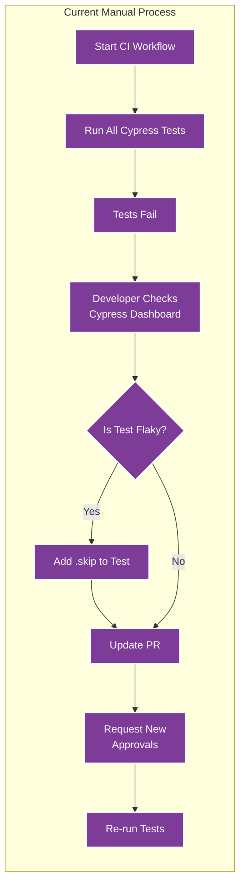
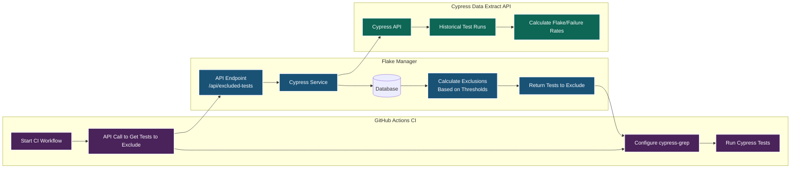
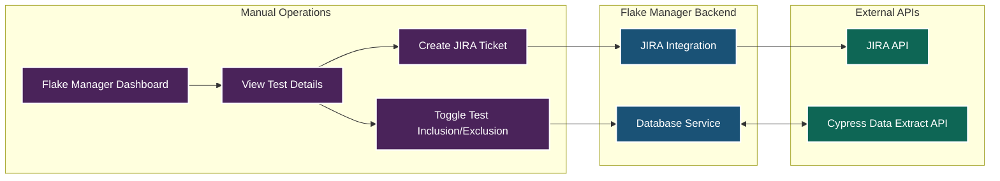

# Flake Manager Workflow

This diagram visualizes how Flake Manager integrates with GitHub Actions workflows to exclude flaky Cypress tests from CI runs.

## Manual Process Being Replaced

## CI Integration Flow

## Manual Test Management Flow

## How It Works

### Current Manual Process (Problems)

The current manual approach to handling flaky tests:

1. **CI Pipeline Runs** all tests without exclusions
2. **Tests Fail**, blocking the build/deployment
3. **Developer Investigates** by checking the Cypress Dashboard
4. If determined to be **flaky**:
   - Developer manually adds `.skip` to the test
   - Updates the PR with the change
   - Requests new approvals for the modified code
   - Re-runs the tests
5. **Process Problems**:
   - Wastes developer time on repeated manual interventions
   - Delays deployments while waiting for fixes and approvals
   - No systematic tracking of flaky tests
   - Inconsistent handling of test reliability issues

### Automated Test Exclusion Process

1. **GitHub Actions Workflow** initiates a CI run
2. The workflow makes an API call to Flake Manager's `/api/excluded-tests` endpoint
3. **Flake Manager**:
   - Gets repository settings with configured thresholds
   - Queries the Cypress Data Extract API for historical test data
   - Calculates which tests exceed flake/failure thresholds
   - Respects any manual overrides set by users
   - Returns a list of test names that should be excluded
4. **GitHub Actions**:
   - Configures cypress-grep with the test names to exclude
   - Runs Cypress tests, skipping the problematic tests

### Manual Test Management Process

1. **Teams use the Flake Manager UI** to:
   - View flaky test metrics and status
   - Manually override exclusion decisions when needed
   - Create JIRA tickets for tests that need developer attention
2. **When overrides happen**:
   - Test exclusion status is stored in the database
   - Future CI runs will respect these manual decisions
   - JIRA tickets can be automatically linked to tests

This approach lets you maintain stable CI pipelines while systematically addressing flaky tests.
